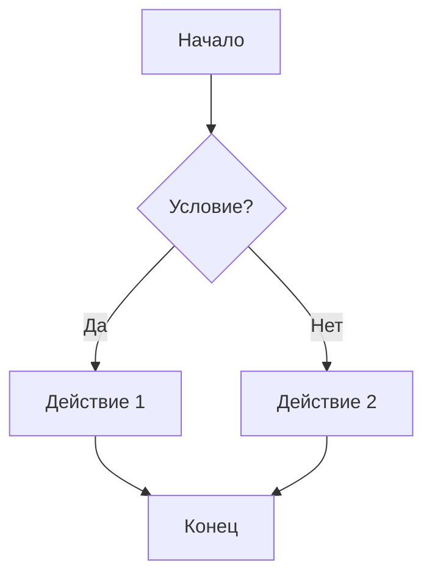

# MindForge

Это тестовый сайт SynvexAI, где можно поиграться с демкой форматирования ReMind.

# MindForge 🧠

**Демонстрационная платформа для форматирования ReMind**

MindForge - это интерактивная веб-страница, демонстрирующая возможности форматирования текста, кода, математических формул и визуализаций, аналогично ReMind.

## ✨ Возможности

### 📝 Текстовое форматирование

- **Markdown** - полная поддержка синтаксиса Markdown
- **HTML** - встроенная поддержка HTML-тегов
- **Типографика** - автоматическое улучшение типографики

### 💻 Подсветка кода

- **Prism.js** - подсветка синтаксиса для множества языков программирования
- **Автоопределение** - автоматическое определение языка программирования
- **Нумерация строк** - опциональная нумерация строк кода
- **Файлы** - поддержка указания имени файла в блоке кода

### 🧮 Математические формулы

- **KaTeX** - быстрый рендеринг математических формул
- **Inline формулы** - формулы в строке с `$...$`
- **Block формулы** - выделенные формулы с `$$...$$`
- **LaTeX синтаксис** - полная поддержка LaTeX

### 📊 Диаграммы и визуализации

- **Mermaid** - создание диаграмм и схем
- **Chart.js** - интерактивные графики и диаграммы
- **D3.js** - продвинутые визуализации данных

### 🎨 Интерфейс

- **Темная/светлая тема** - переключение между темами
- **Адаптивный дизайн** - оптимизация для всех устройств
- **Современный UI** - красивый и интуитивный интерфейс

## 🚀 Быстрый старт

### Требования

- Современный веб-браузер с поддержкой ES6+
- Локальный веб-сервер (для корректной работы)

### Установка

1. Клонируйте репозиторий:

```bash
git clone https://github.com/SynvexAI/MindForge
cd MindForge
```

2. Запустите локальный сервер:

```bash
# Python 3
python -m http.server 8000

# Node.js
npx serve .

# PHP
php -S localhost:8000
```

3. Откройте браузер и перейдите по адресу `http://localhost:8000`

## 📖 Использование

### Основные функции

1. **Ввод текста** - вставьте ваш текст в текстовое поле
2. **Форматирование** - используйте Markdown синтаксис
3. **Отображение** - нажмите кнопку "Отобразить"
4. **Результат** - просмотрите отформатированный текст

### Примеры использования

#### Markdown

```markdown
# Заголовок 1

## Заголовок 2

**Жирный текст** и _курсив_

- Список
- Элемент 1
- Элемент 2
```

#### Код

````markdown
```javascript:example.js
function hello() {
    console.log("Hello, World!");
}
```
````

#### Математические формулы

```markdown
Inline формула: $E = mc^2$

Block формула:

$$
\int_{-\infty}^{\infty} e^{-x^2} dx = \sqrt{\pi}
$$
```

#### Диаграммы Mermaid

````markdown

````

#### Графики Chart.js

````markdown
```chartjs
{
    "type": "line",
    "data": {
        "labels": ["Янв", "Фев", "Мар"],
        "datasets": [{
            "label": "Продажи",
            "data": [12, 19, 3]
        }]
    }
}
```
````

## 🛠️ Технологии

- **Frontend**: HTML5, CSS3, JavaScript (ES6+)
- **Markdown**: markdown-it
- **Подсветка кода**: Prism.js
- **Математические формулы**: KaTeX
- **Диаграммы**: Mermaid
- **Графики**: Chart.js
- **Визуализации**: D3.js
- **Безопасность**: DOMPurify

## 📁 Структура проекта

```
MindForge/
├── index.html          # Главная HTML страница
├── script.js           # Основная логика JavaScript
├── style.css           # Стили CSS
├── prism.css           # Стили для подсветки кода
├── elements/           # Иконки и изображения
│   ├── audio.png
│   ├── copy.png
│   ├── download.png
│   ├── edit.png
│   └── table-icon.png
├── favicon.png         # Иконка сайта
└── README.md           # Документация
```

## 🔧 Настройка

### Кастомизация тем

Темы можно настроить в файле `style.css`, изменив CSS переменные:

```css
:root {
  --color-bg-surface: #1a1a1a;
  --color-text-primary: #ffffff;
  --color-accent: #007acc;
}
```

### Добавление новых языков

Для добавления новых языков программирования используйте Prism.js плагины в `index.html`.

## 🌟 Особенности

- **Производительность** - быстрая загрузка и рендеринг
- **Безопасность** - защита от XSS атак
- **Доступность** - поддержка клавиатурной навигации
- **Интернационализация** - русский язык по умолчанию

## 🤝 Вклад в проект

Мы приветствуем вклад в развитие проекта! Если у вас есть идеи по улучшению:

1. Создайте Issue с описанием предложения
2. Сделайте Fork репозитория
3. Создайте ветку для новой функции
4. Внесите изменения и создайте Pull Request

## 📄 Лицензия

Этот проект распространяется под лицензией, указанной в файле [LICENSE](LICENSE).

## 🔗 Ссылки

- [ReMind](https://boosty.to/blootber) - основное веб-приложение
- [Markdown Guide](https://www.markdownguide.org/) - справочник по Markdown
- [KaTeX](https://katex.org/) - документация по математическим формулам
- [Mermaid](https://mermaid.js.org/) - документация по диаграммам

## 📞 Поддержка

Если у вас возникли вопросы или проблемы:

- Создайте Issue в репозитории
- Опишите проблему подробно
- Приложите скриншоты, если необходимо
